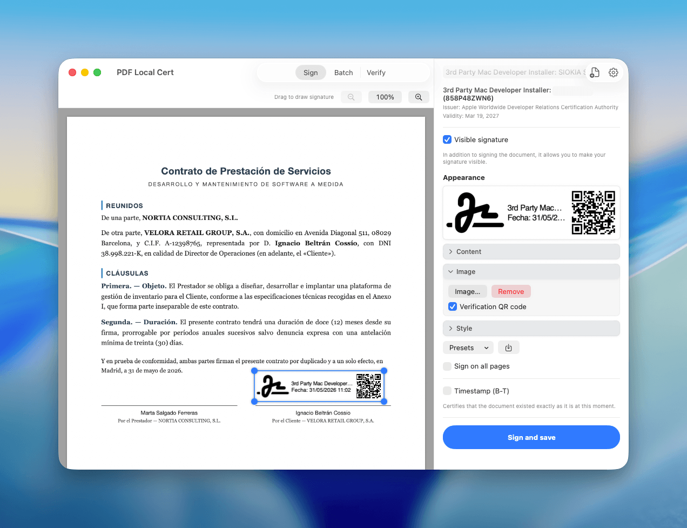

<!-- ╔══════════════════════════════════════════════════════════════════╗ -->
<!-- ║                          H E R O                                   ║ -->
<!-- ╚══════════════════════════════════════════════════════════════════╝ -->

<div align="center">


# PDF Local Cert

### Sign PDFs on your Mac with the certificates you already own.
#### No Java. No Adobe. No AutoFirma. 100% on your device.

<p>
  
  
  
  
  
</p>

<p>
  <a href="https://github.com/afanjul/pdf-local-cert/releases"><b>⬇️&nbsp; Download</b></a>
  &nbsp;·&nbsp;
  <a href="#-build-from-source"><b>🛠️&nbsp; Build from source</b></a>
  &nbsp;·&nbsp;
  <a href="#-verify"><b>✅&nbsp; Verify a signature</b></a>
</p>

<br/>



</div>

<br/>

> **Your signature, your key, your machine.** PDF Local Cert reads the X.509 certificates
> already in your macOS Keychain (FNMT, DNIe, qualified eIDAS) and produces legally-shaped
> **PAdES** signatures — without your private key ever leaving the Keychain, and without a
> single byte leaving your Mac.

---

<!-- ╔══════════════════════════════════════════════════════════════════╗ -->
<!-- ║                          D E M O S                                ║ -->
<!-- ╚══════════════════════════════════════════════════════════════════╝ -->

## 🎬 See it in action

<table>
<tr>
<td align="center" width="50%"><b>✍️&nbsp; Sign a single PDF</b></td>
<td align="center" width="50%"><b>⚡&nbsp; Batch signing</b></td>
</tr>
<tr>
<td width="50%">

https://github.com/user-attachments/assets/4a0bb071-1447-4f06-846d-9b2889d0c234

</td>
<td width="50%">

https://github.com/user-attachments/assets/f9d4f247-d69a-44f3-ab1e-9947754edaf4

</td>
</tr>
<tr>
<td align="center"><sub>Pick a Keychain cert, place the signature, sign &amp; save.</sub></td>
<td align="center"><sub>Drop many PDFs, sign them all in one pass.</sub></td>
</tr>
</table>

---

<!-- ╔══════════════════════════════════════════════════════════════════╗ -->
<!-- ║                    W H Y   /   COMPARISON                          ║ -->
<!-- ╚══════════════════════════════════════════════════════════════════╝ -->

## 🤔 Why not just use AutoFirma or Adobe?

<div align="center">

| | 🟢 **PDF Local Cert** | 🟡 AutoFirma | 🔴 Adobe Acrobat |
|---|:---:|:---:|:---:|
| **Native macOS app** | ✅ SwiftUI | ❌ Java applet | ✅ |
| **Reads Keychain certs** | ✅ | ⚠️ clunky | ⚠️ |
| **Works fully offline** | ✅ | ✅ | ❌ account |
| **Visible signature designer** | ✅ drag, image, QR | ⚠️ basic | ✅ |
| **Batch signing** | ✅ | ⚠️ | 💰 paid |
| **Trusted timestamp (B-T)** | ✅ RFC 3161 | ✅ | 💰 |
| **Price** | **Free / one-time** | Free | 💸 subscription |
| **Open source** | ✅ GPL-3.0 | ⚠️ | ❌ |

</div>

---

<!-- ╔══════════════════════════════════════════════════════════════════╗ -->
<!-- ║                        F E A T U R E S                            ║ -->
<!-- ╚══════════════════════════════════════════════════════════════════╝ -->

## ✨ Features

<table>
<tr>
<td width="50%" valign="top">

### 🔐 Sign with your real certificates
Reads X.509 identities straight from the macOS Keychain — **FNMT**, **DNIe**, any qualified **eIDAS** certificate. The private key **never leaves** the Keychain.

</td>
<td width="50%" valign="top">

### 📜 Standards-compliant
Produces **PAdES&nbsp;B-B** and **PAdES&nbsp;B-T** signatures with an **RFC&nbsp;3161** trusted timestamp. Reported as **valid in Adobe Acrobat** with real FNMT / UANATACA certs (EU Trust List).

</td>
</tr>
<tr>
<td width="50%" valign="top">

### 🎨 Visible-signature designer
**Drag** to place the box anywhere · add a **handwritten image** · verification **QR badge** · border, background, font size, multiline text · save layouts as **presets**.

</td>
<td width="50%" valign="top">

### ⚡ Batch & all-pages
Drop **multiple PDFs** and sign them in one go. Stamp the signature on **every page** with a single toggle.

</td>
</tr>
<tr>
<td width="50%" valign="top">

### ✅ Built-in verifier
Drag any signed PDF onto the **Verify** tab to check signer, integrity and timestamp — yours or someone else's.

</td>
<td width="50%" valign="top">

### 🕶️ Private & native
**No telemetry, no cloud, no account.** SwiftUI app with light/dark themes, in **Spanish & English**.

</td>
</tr>
</table>

---

<!-- ╔══════════════════════════════════════════════════════════════════╗ -->
<!-- ║                      H O W   I T   W O R K S                      ║ -->
<!-- ╚══════════════════════════════════════════════════════════════════╝ -->

## 🧭 How it works

```
  ┌──────────┐     ┌──────────────┐     ┌───────────────┐     ┌──────────┐
  │ Drag PDF │ ──▶ │ Pick a cert  │ ──▶ │ Place & style │ ──▶ │ Sign &   │
  │          │     │ (Keychain)   │     │  + timestamp  │     │  save ✅ │
  └──────────┘     └──────────────┘     └───────────────┘     └──────────┘
```

1. **Drag a PDF** into the window.
2. **Pick a certificate** from your Keychain.
3. Choose **invisible** or **visible**, then place & style the signature.
4. *(Optional)* enable a **trusted timestamp (B-T)**.
5. Hit **Sign and save**. Done.

---

<!-- ╔══════════════════════════════════════════════════════════════════╗ -->
<!-- ║                    P R I C I N G   /   O S S                      ║ -->
<!-- ╚══════════════════════════════════════════════════════════════════╝ -->

## 💚 Open source — and sustainable

PDF Local Cert is **open source under [GPL-3.0](LICENSE)**. Two honest ways to use it:

<div align="center">

| | 🧑‍💻 **Build it yourself** | ⭐ **Get the signed app** |
|---|:---|:---|
| **Price** | Free, forever | One-time license |
| **How** | Clone & compile (below) | Notarized, ready-to-run download |
| **Signatures** | Unlimited | Free: 10/mo · **Pro: unlimited** |
| **Appearance designer** | ✅ | **Pro** |
| **Supports development** | ⭐ (a star helps!) | 💚 |

</div>

> Same model as the best indie Mac apps: the full source for tinkerers, a convenient
> signed-and-notarized download for everyone who'd rather not open a terminal.

---

<!-- ╔══════════════════════════════════════════════════════════════════╗ -->
<!-- ║                       T E C H N I C A L                           ║ -->
<!-- ╚══════════════════════════════════════════════════════════════════╝ -->

## 🏗 Architecture

> A thin **SwiftUI** shell for the UX and Keychain, and a focused **Rust** core for the
> cryptographic PDF surgery. They talk over a tiny `prepare → sign → finalize` protocol.

| Part | Path | Role |
|------|------|------|
| **SwiftUI shell** | `Sources/PDFLocalCert/` | UI, PDFKit rendering, Keychain enumeration, `SecKeyCreateSignature`, save, verifier |
| **Rust sidecar** | `core/` | PDF byte-range surgery, CMS / PAdES assembly, RFC 3161 TSA client, verification |

<details>
<summary><b>🔑 How the key stays in the Keychain (external-signer pattern)</b></summary>

<br/>

The shell **never exports** the private key:

1. The Rust **core** builds the PDF byte range and returns the `SignedAttributes` to be signed.
2. The Swift **shell** signs those bytes via the Keychain (`SecKeyCreateSignature`) — the key stays sealed.
3. The **core** splices the resulting **CMS** back into the PDF and writes the output.

This is the same callback/external-signer model used by qualified-signature tooling, so
hardware-backed keys (DNIe, smartcards) work transparently.

</details>

<details>
<summary><b>🧰 Stack</b></summary>

<br/>

- **UI:** Swift 6 · SwiftUI · PDFKit · Security framework
- **Core:** Rust — hand-rolled DER/CMS, PAdES B-B/B-T, RFC 3161 timestamping
- **Targets:** macOS 14+ · Apple Silicon & Intel

</details>

## 🛠 Build from source

> **Requirements:** Xcode / Swift toolchain · Rust (`cargo`).

```sh
# Ad-hoc signed → build/PDF Local Cert.app
bash scripts/build.sh

# Or sign with your Apple Developer identity
SIGN_ID="Apple Development: Your Name (TEAMID)" bash scripts/build.sh

# Run it
open "build/PDF Local Cert.app"
```

<details>
<summary><b>⚙️ Cargo / sandbox note</b></summary>

<br/>

`build.sh` invokes cargo by absolute path with the git index protocol
(`CARGO=/opt/homebrew/bin/cargo` + `CARGO_NET_GIT_FETCH_WITH_CLI=true`) so crates.io
fetches succeed under sandboxed shells.

</details>

## ✅ Verify

The **Verify** tab validates any signed PDF (signer · integrity · timestamp). Under the hood,
the Rust core exposes a `prepare → sign → finalize → verify` protocol that can be driven with
an OpenSSL key instead of a Keychain identity — so the cryptography is testable without a real
certificate. Validated end-to-end for **B-B** and **B-T** (`valid=true, crypto=ok`).

## 📂 Project layout

```
Sources/PDFLocalCert/      SwiftUI app
Sources/PDFLocalCertKit/   shared helpers (coordinate mapping…)
core/                      Rust signing sidecar
Resources/                 Info.plist, entitlements, icons, localized strings, logo
scripts/                   build.sh, make-icns.sh
docs/                      implementation spec, progress, task checklist
samples/                   example contract PDF for demos
```

---

<div align="center">

Renamed from *FirmaFast* · Built with ❤️ for everyone who fights with AutoFirma.

**[GPL-3.0](LICENSE) © Alejandro Fanjul**

<sub>Implementation notes in <a href="docs/"><code>docs/</code></a> — start with <a href="docs/PROGRESS.md"><code>PROGRESS.md</code></a>.</sub>

</div>
